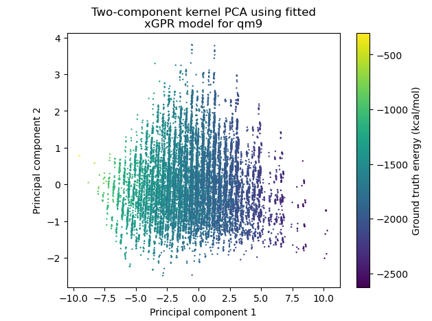

Clustering and visualizing data
================================

You can also use random features generated by xGPR for kernel PCA and for
clustering. xGPR has a tool that will generate the random features
for your data for you, and then you just run k-means or PCA on the resulting
features using your package of choice. This is (approximately) equivalent to running
kernel k-means or kernel PCA on the original data, but faster, because there is no
need to construct an N x N kernel matrix. Also, it enables you to use
the graph and sequence kernels in xGPR for clustering or visualization.
(It is also possible to use another algorithm aside from k-means to cluster
the random features representations, although due to its scalability k-means
is a popular choice.)

We recommend using a smaller number of random features for these operations.
While a larger number of random features means a more accurate kernel
approximation, it also will slow down k-means or PCA significantly.
Typically k-means and PCA are used in situations where a crude
approximation is probably acceptable.

For example, here is a kernel PCA of the QM9 dataset (130,000 small
molecules) generated using the random features produced by a GraphConv1d
kernel, trained on one-hot encoded input data:

Generating random features
----------------------------

To generate random features, use the KernelFGen tool below:::

  from xGPR import KernelFGen

  fgen = KernelFGen(num_rffs = 512, hyperparams = np.array([1.0]),
                    num_features = 24, kernel_choice = "RBF",
                    kernel_settings = {}, random_seed = 123, verbose = True,
                    num_threads = 2)

  my_feature_rep = fgen.predict(my_input_numpy_array, sequence_lengths = None,
                                           chunk_size = 2000)

Now you can cluster ``my_feature_rep`` -- it's just a random features representation
of your input -- or do PCA.

``num_features`` here is the last dimension of the inputs you will
supply. If your input is fixed vectors, then this should be dim1 of
the fixed vector input. If by contrast you are using a sequence /
graph kernel, this should be the number of features per graph element /
sequence element.

Note some important things here. First, the ``KernelFGen`` is like an
xGPRegression model that doesn't do hyperparameter tuning and is fitted
as soon as it's created. This means that you have to supply (the log of) the
hyperparameters as a numpy array.

All xGPR kernels have at least one hyperparameter. Most have either one or two
hyperparameters. If the kernel has only one hyperparameter (e.g. polynomial
kernels, linear kernels, arc-cosine kernels) you don't need to supply anything for
hyperparameters. You only need to supply a hyperparameter for kernels that
have two hyperparameters, e.g. RBF, Matern, GraphRBF, FHTConv1d -- in that case
you need to supply the second hyperparameter for the kernel as shown above.

How to choose a hyperparameter for a kernel that requires it for clustering? If you've fitted a
Gaussian process regression model to your data, that's easy -- just call:::

  my_model.get_hyperparams()

the log of the hyperparameters is returned, you can take the second value in the array
that is returned and plug it into ``KernelFGen``. If NOT,
however, selecting a good hyperparameter can be a little trickier. See the examples / 
tutorials for some examples of how this affects the results. Some kernels accept
additional settings under the ``kernel_settings`` dict, e.g. the degree of a polynomial;
see the kernels section for more details.

Setting a larger ``chunk_size`` increases the number of datapoints that
are processed at a time, which increases memory consumption but
slightly increases speed.
