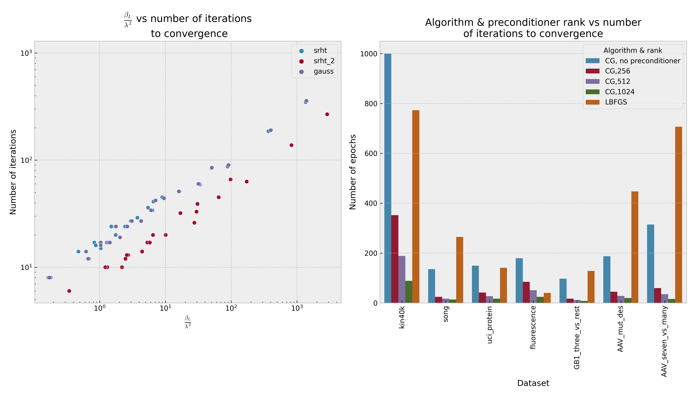

Model Fitting -- In depth
======================================

Once you've tuned hyperparameters (or if you already
in advance have hyperparameters which you know will work
well from previous experiments), you're ready to fit.
Fitting is faster, easier and more foolproof than tuning,
and the default options usually work well,
but if you want more fine-grained control, there's some
additional knobs you can turn.

Preconditioning
----------------

Preconditioning is the heart and core of how iterative (non-exact) model
fitting is done in xGPR. If fitting in ``mode=exact``, of course, a
preconditioner is not required; preconditioners are used for ``mode=cg``.
``mode=exact`` is very fast for smaller numbers of RFFs (e.g. 4096), but
for a larger number of RFFs, CG is the way to go, and this is where
preconditioners are useful.

Building a preconditioner
requires either one or two passes over the dataset. When you call
``fit``, xGPR will ordinarily automatically choose a preconditioner
size for you. If you'd like to control that process yourself
instead, or even have a little more control over the automated
process that xGPR is using, here's how to do it.

To build your own preconditioner, use:

.. autoclass:: xGPR.xGPRegression
   :members: build_preconditioner

``method = 'srht'`` uses a fast Hadamard transform based construction
with a single pass over the dataset. ``method = 'srht_2'``, by contrast,
runs two passes over the dataset and does involve some matrix
multiplications, so it is more expensive, but the resulting preconditioner
is always better. A preconditioner built with 'srht_2' will usually reduce
the number of iterations required to fit by about 20-25% compared with one
built with 'srht'.

The ``ratio`` is a pretty good predictor of how many iterations it will
take xGPR to fit. See the following chart, where ``ratio`` is referred
to as beta / lambda^2. (The ratios here are all for "srht". "srht_2"
will generally increase the ratio slightly but decrease the actual number
of iterations needed to fit as illustrated).

Smaller ratios in general mean fewer iterations are required to fit. Each iteration
is a single pass over the dataset (similar to an epoch when training a deep learning
model but generally much faster). The ratio in turn is a dataset-dependent
function of ``max_rank``. Notice that the relationship between ratio and
number of iterations is different for ``srht`` and ``srht_2``; ``srht_2`` is
better but as noted requires two passes over the data to build.

If based on the ratio we obtain, we think that fitting
will take more iterations than we would like, we can reconstruct the preconditioner
using a larger ``max_rank`` and get a better ratio (doubling ``max_rank`` is
usually a good step to take). Bear in mind however that large values of
``max_rank`` are also expensive, because preconditioner construction requires
a matrix decomposition, which is cheap for say 512 x 512 or 1024 x 1024, but
not so much for very large ``max_rank``. Therefore the goal is to push
``max_rank`` high enough to get an acceptable likely number of iterations,
but not so high that it is unnecessarily expensive to construct. In our
experiments, we have rarely needed to take ``max_rank`` higher than 2000,
but it is of course possible to do so if necessary.

Note that the chart above was constructed using fits with ``tol=1e-6``. The number
of iterations will be greater if you select a tighter ``tol`` and less with a
looser ``tol``. Also note that for very small values of the ``lambda`` hyperparameter
(shared by all kernels, and the first hyperparameter that is returned
from ``model.get_hyperparams()``) is very small, the ``ratio`` may 
dramatically overestimate how many iterations are required to fit. See the 
molecule example on the main page for a case where the ratio is > 1000 but the model
fits in << 100 iterations! Consequently, the graph above should
only be used as a rough guide. When in doubt, a quick experiment on a subset of the
data may prove helpful in deciding what ``ratio`` is "good enough" before 
building a preconditioner on the full dataset and fitting.

Fitting
--------

If you build your own preconditioner, you can pass it to the fit() function.
Alternatively, you can still use xGPR's automated procedure for building a
preconditioner while taking more fine-grained control of that automated
procedure. This avoids the hassle of building the preconditioner yourself
while giving you some additional control to ensure the fastest fit possible.
Here's an overview of what you can do:

.. autoclass:: xGPR.xGPRegression
   :members: fit

Note that the alternative ``mode=exact`` is preferable if the
number of RFFs is small, where it will generally get better speed (it has
poor scalability to large numbers of RFFs). For exact fitting, no
preconditioner is required.

Finally, note that ``mode=lbfgs`` is available as an alternative. We don't
really recommend this -- it's mostly used for testing. In the past, we've found
that both LBFGS and numerous flavors of stochastic gradient descent are
substantially slower for fitting than exact and preconditioned CG, at least
for tol < 1e-4.

As a side note: SGD is popular in the literature because it works well for
deep learning. Most papers that recommend some flavor of SGD haven't tried
to use it for high-dimensional linear problems that may sometimes be
ill-conditioned and where a tight fit is desired -- SGD does NOT work well
compared to preconditioned CG under this particular set of circumstances,
at least Adam, AMSGrad, SVRG, and the other usual suspects. The amount of
learning rate and learning rate schedule tuning required to get SGD to work
well is simply not acceptable for an out of the box fitting routine.
