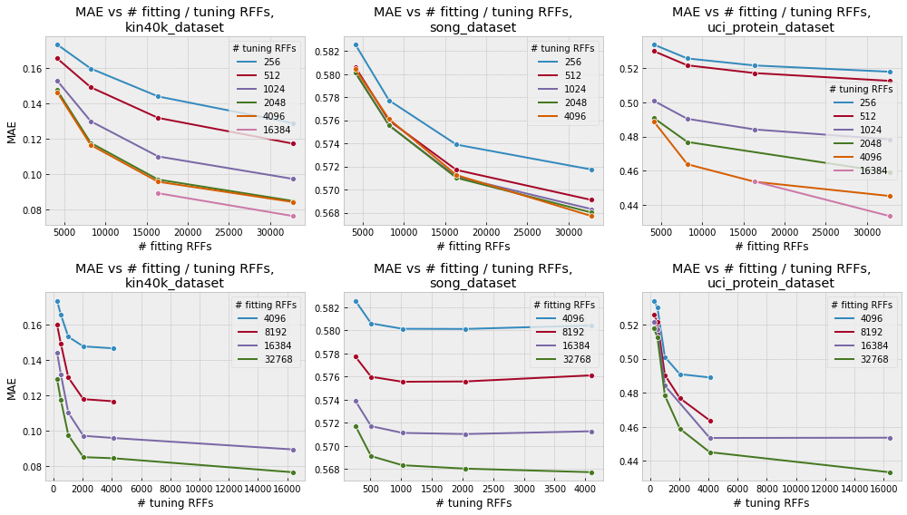

How kernels are approximated in xGPR
===============================================

An exact kernel machine measures the similarity of each training datapoint
to every other training datapoint using a kernel function. This is completely
impractical for large datasets (consider constructing a one million by one
million matrix for a million-datapoint dataset.)

xGPR approximates the kernel matrix by representing each datapoint using a
set of "random features", a representation constructed such that the
dot product between any two representations is approximately equivalent
to the exact kernel measurement. This converts Gaussian process regression
into ridge regression. xGPR uses an efficient fast Hadamard transform
based procedure to do this, and incorporates a variety of "tricks" that
dramatically speed up fitting for the resulting model.

The more random features you use, the more accurate the approximation
and the closer to an exact kernel machine. The error decreases exponentially
with the number of random features, so that if going from 1024 to
2048 random features improves model accuracy by a lot, going from
2048 to 4096 will improve it but not by as much, and then going from
4096 to 8192 will improve it but still less, and so on.
The graph below illustrates how mean absolute error on held-out test
sets for some (fairly random) UCI machine learning datasets decreases
as the number of random features used for tuning hyperparameters
or for fitting the model increases.

Notice that increasing the number of random features is nearly always
beneficial, but with diminishing returns. This means that if our
xGPR model is performing pretty well but we'd like it to perform
a little better -- just use more random features. If perforance is dramatically below
what we need, by contrast, and increasing the number of RFFs isn't helping
very much, we know we need to switch to a different kernel, feature set or
use another modeling technique instead of a GP.

How many random features do I need?
------------------------------------

The hyperparameter settings that give good performance with
a small number of random features are usually close to the ones
that give good performance with a large number of random features.
So, we like to use a small number of random features to pick a kernel
and to figure out what region of hyperparameter space is likely best.
By using a small number of random features (e.g. 512 - 2048) we make
these "screening" experiments fast. Once we've picked a kernel, we
use a larger number of random features (e.g. 8192 - 16,384) to "fine
tune" the hyperparameters and fit the model. See the quickstart tutorial
and the examples on the main page for some illustrations. 

As a general rule, the more high-dimensional the input data, the more RFFs you will likely
need for an effective approximation. Thus, the RFF approximation (and xGPR
in general) may not make sense if your data is very high-dimensional.

The variance (i.e. the uncertainty) on new predictions for regression
is a useful quantity, but it generally only needs to be calculated very
approximately. We recommend using 512 - 2048 random features for
variance; this should be sufficient for an estimate in most cases.
We often use 1024. The ``variance_rffs`` for variance calculation
has to be < the ``num_rffs`` for predictions. For classification,
variance isn't calculated separately at this time.
