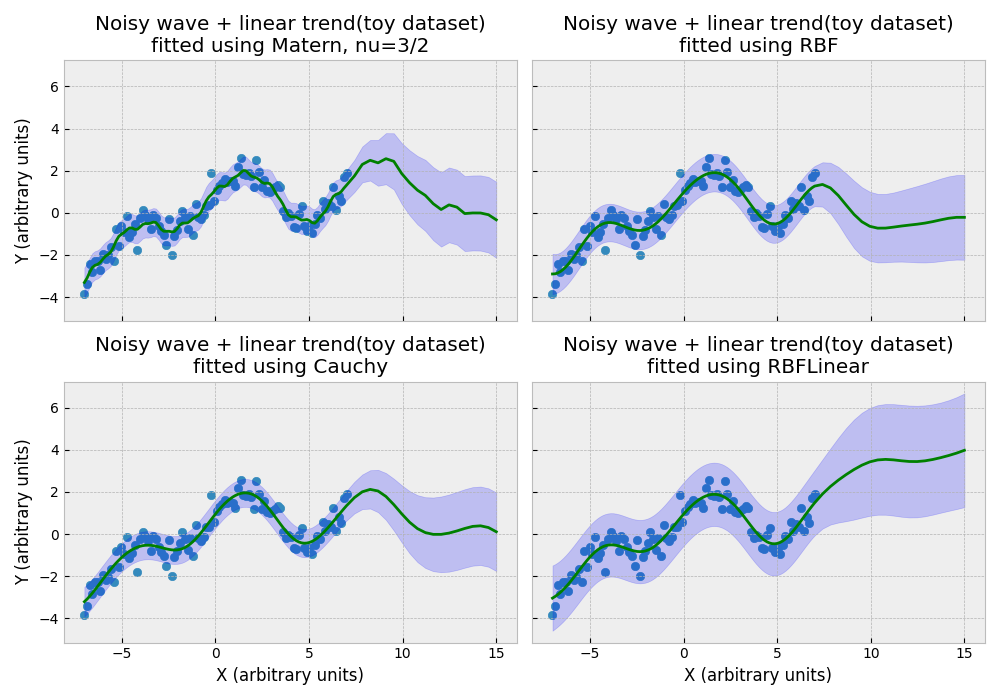

Kernels for fixed-vector input
-------------------------------

These kernels handle fixed vector input, similar to a fully-
connected NN. To use one of these, when initializing the
model, set ``kernel_choice = 'kernel name'``, e.g.
``kernel_choice = "RBF"``.

.. list-table:: Fixed-vector kernels
   :align: center
   :header-rows: 1

   * - Kernel Name
     - Description
     - kernel_settings
   * - RBF
     - | Models smooth, infinitely differentiable
       | functions; good default.
     - | "intercept":bool
   * - Matern
     - | Models "rougher" functions than RBF.
       | nu = 5/2 models twice differentiable functions,
       | nu=3/2 models once differentiable functions, nu=1/2
       | models functions that are not differentiable. These
       | kernels can sometimes avoid "concentration of measure"
       | issues encountered by the RBF kernel in high-dimensional
       | spaces.
     - | "matern_nu":float
       | "intercept":bool
   * - Cauchy
     - | A scale mixture of RBF kernels; models functions that
       | vary smoothly across multiple lengthscales.
       | This is a rational quadratic kernel with degrees of
       | freedom set to 1.
     - | "intercept":bool
   * - RBFLinear
     - | The sum of a linear kernel and an RBF kernel. Models
       | functions that are close to linear but with some fairly
       | smooth "wiggles". Use "intercept" to indicate if a y-
       | intercept should be fitted.
     - | "intercept":bool
   * - Linear
     - | Equivalent to Bayesian linear regression.
       | Use "intercept" to indicate if a y-
       | intercept should be fitted.
     - | "intercept":bool
   * - MiniARD
     - | Same as RBF, but rather than having one
       | lengthscale shared between all features,
       | applies different lengthscales to different
       | groups of features.
     - | "split_points":list

The ``Linear`` kernel is equivalent to Bayesian linear regression.
If ``intercept`` is False, it will be fitted without a y-intercept
(generally it is preferable to set ``intercept`` to True).

The ``MiniARD`` is an RBF kernel that assigns a different lengthscale
to different kinds of features. You might have data, for example,
where some features are one-hot encoded and others are real. If
so, you could use MiniARD and "learn" a different lengthscale for
each type of feature. Hyperparameter tuning for ``MiniARD`` is more
challenging than for most kernels because it has > 2 hyperparameters.
If you're interested in using this kernel, see the Advanced or In-Depth
tutorials for more on how to tune it.

For ``MiniARD``, supply a list under
``kernel_settings`` when creating a model, e.g.:::

  my_model = xGPRegression(num_rffs = 2048, variance_rffs = 512,
                        kernel_choice = "MiniARD",
                        device = "cuda", kernel_settings =
                        {"split_points":[21,36])

The features in between two split points all share a lengthscale. In this
case, for example, features from 0:21 in the input would share one
lengthscale, features from 21:36 would share another, and features from
36: would share another lengthscale (0 and len(feature_vector) are automatically
added to the beginning and end of split_points). This technique can be
very powerful but also does make tuning more complicated and much slower,
especially if the number of lengthscales is very large, so use judiciously.
The lengthscales learned by ``MiniARD`` during tuning can be used as crude
measures of relative importance (larger = more important group of features).

The chart below illustrates how some of these kernels fit a simple
toy dataset with a noisy sine wave, a noisy cosine wave, and a linear trend.

RBF assumes the functions you are modeling are extremely smooth
(i.e. infintely differentiable), and when this assumption is true,
it can achieve very good performance -- indeed, RBF can model this
toy dataset using just 8 - 12 RFFs. This is the classic "default" kernel.
It computes the similarity of any two datapoints using

.. math::

  e^{-\sigma ||x_1 - x_2||^2}
  
where sigma is a hyperparameter
we will tune. Large values for sigma the function varies rapidly
on very short lengthscales, while small values mean the function
varies slowly over long distances.

Note that a Matern is somewhat "bumpier" even with nu=3/2; with nu=1/2,
Matern is extremely "bumpy", which may occasionally be useful but is
not a good default. A Matern nu=1/2 kernel corresponds to a Laplace
kernel, which measures similarity of datapoints using Manhattan
distance (unlike Euclidean distance in the RBF kernel).

The RBFLinear kernel is the sum of a linear kernel and an RBF kernel
and assumes a linear trend. We only recommend RBFLinear if the number
of features in your input is relatively small, since the kernel will
produce ``num_rffs - input_shape[1]``, so that if the input has a large
number of features, you'll need to set num_rffs quite high even for
initial experiments.

The Cauchy or rational quadratic kernel is a scale mixture of RBFs with
different lengthscales. It measures the similarity of any two datapoints
using 

.. math::

  k(x_1, x_2) = (1 + \sigma ||x_1 - x_2||^2)^{-1}

Generally exchanging RBF for Cauchy or Matern makes only a small difference in
validation set performance -- usually one of these kernels will perform better
than the others but the gains are usually modest. If test set performance 
is your primary concern and you are not sure which kernel makes sense
for your application, we recommend using the RBF kernel as a default, and
potentially experimenting with the alternatives to see if they can provide
some additional small gains.
