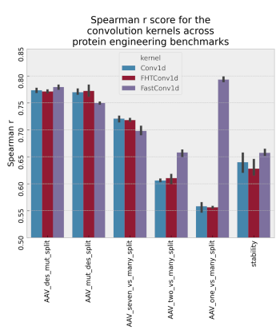

Kernels for sequence and time series data (non-static)
------------------------------------------------------

These kernels handle sequence and time series data,
similar to a 1d CNN with global average pooling.
To use one of these, when initializing the
model, set ``kernel_choice = 'kernel name'``, e.g.
``kernel_choice = "FHTConv1d"``. See
:doc:`Getting started</initialization_tutorial>`
for details.

*IMPORTANT NOTE*: In addition to these choices, you can use the
FastConv1d kernel for sequences, which is described under Static
Layers since it is implemented as a Static Layer rather than
as a kernel. FastConv1d compares sequences in a different way that
may in some cases be beneficial. See the graph below for some
comparisons.

.. list-table:: Sequence Kernels
   :align: center
   :header-rows: 1

   * - Kernel Name
     - Description
     - kernel_specific_params
   * - FHTConv1d
     - | Compares sequences by averaging over
       | an RBF kernel applied pairwise to
       | all subsequences of length "conv_width"
       | in the two sequences.
     - "conv_width":int
   * - Conv1d
     - | Same as "FHTConv1d", but slighty
       | faster for small "conv_width" or
       | few features per sequence element,
       | much slower for large. This kernel
       | is deprecated and will be removed
       | in an upcoming release.
     - | "conv_width":int

If we have a sequence (or time series) of length N and d = conv_width,
to measure the similarity of two sequences A and B, these kernels take all the
length d subsequences of A and for each length d subsequence in A,
evaluate an RBF kernel on it against all length d subsequences in B. The
net similarity is the average across all of these. If implemented as
described, of course, this kernel would be extremely inefficient. In xGPR,
however, we implement this kernel in such a way we can achieve *linear
scaling* in both number of datapoints and sequence length!

The FHTConv1d and Conv1d kernels perform the same operation, but FHTConv1d
is MUCH faster if there are many features per sequence element or the
conv_width is large, whereas Conv1d may be slightly faster for
small "conv_width" or number of features per sequence element. Also,
for large numbers of random features, FHTConv1d is much more efficient. In
general, then, prefer FHTConv1d.

The chart below contrasts the performance of FHTConv1d, Conv1d and
FastConv1d (a static layer kernel for sequences, see below) on some of the
FLIP benchmarks (a protein sequence benchmark) and the TAPE benchmarks
(similar), using one-hot encoded sequences as input and Spearman's r
as a measure of performance, with the same number of random features used
for all kernels. The error bar is across different random seeds. FHTConv1d
and Conv1d are similar as expected.

Be aware that these convolution kernels are a slower than
fixed-vector input kernels, because to avoid using excessive
memory, the convolutions are performed in batches (rather
than all at once). As a compensating factor, they frequently
need fewer random features to achieve good performance.

